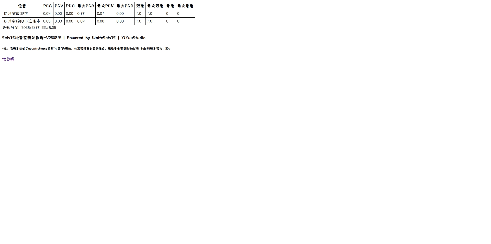

# 第二个用通义AI写的，改了很多遍的屎山代码（全是AI写的，后面改bug用到了Deepseek）
## SeisJSMap-描述：
### SeisJSMap是基于Wolfx SeisJS 项目来制作的一个SeisJS测站显示网站（需要用到网站搭建工具搭建此项目）
### 如果不会搭建此项目可以直接访问[这是个网站](http://eewapp.yiyunstudio.top/wolfxseisjs/) 🚀
## 引用：
### [Wolfx SeisJS项目](https://wolfx.jp/seisjs/) 🚀
### [使用了NIED的震度渐变条](https://www.bosai.go.jp/e/index.html) 🚀
### [使用了JQuake的音效](https://jquake.net/) 🚀
### (如果此项目侵犯了您的权益，请发 Issue 或 联系我[1922445806@qq.com](mailto:1922445806@qq.com))
## 使用教程：
### 下载zip文件
### 解压到宝塔服务器
### 直接点宝塔的添加站点部署
## 文件介绍：
### /index.html是表格版的数据查看器
### /map/index.html是地图版的
## 更新记录：
### 版本日志：V241126
### 修复了测站触发后地图缩放问题（直接把缩放代码扔了😋）
### 保留了测站触发后以当前zoom移动到触发测站位置
### 更新各个震度的音效
### （非电脑端测站位置显示错误的BUG仍然没修）
### 版本日志：V241208
### 测站颜色不再单一，已进行插值处理，平滑的颜色~😋
### （非电脑端（实测1920x1080无缩放分辨率没问题）测站位置显示错误的BUG仍然没修😭）
### 版本日志：V250215
### 修复测站点位颜色白框bug~😋
### 测站位置显示错误的BUG终于修了😭😭😭（DeepSeek无敌）
## 截图：
地图版：

表格版：

